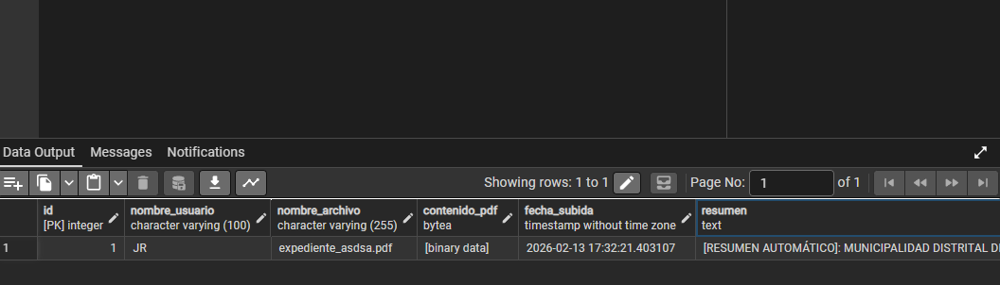

# 📊 Aprendiendo PostgreSQL - Proyecto de Investigación

Este proyecto es una guía completa y una herramienta funcional para gestionar documentos de investigación (PDFs) utilizando **PostgreSQL**, **Python** e **IA**.

## 🚀 Funcionalidades
- **Subida de PDFs**: Script interactivo para subir archivos directamente a la base de datos.
- **Resumen Inteligente**: Procesamiento de lenguaje natural para generar resúmenes automáticos.
- **Dashboard Web**: Interfaz moderna para visualizar tus investigaciones y sus resúmenes.
- **Gestión DB**: Scripts para preparar y actualizar tu base de datos.

## 📸 Resultado Final
¡Lo logramos! Aquí tienes la visualización de los datos subidos y procesados con su resumen:



## ⚙️ Cómo Clonar y Configurar
Si quieres usar este proyecto en otra computadora, sigue estos pasos:

1.  **Clonar el repositorio**:
    ```bash
    git clone https://github.com/r19junior/AprendiendoAUsarPostgress.git
    cd AprendiendoAUsarPostgress
    ```
2.  **Crear un entorno virtual** (Opcional pero recomendado):
    ```bash
    python -m venv .venv
    .\.venv\Scripts\activate
    ```
3.  **Instalar dependencias**:
    ```bash
    pip install -r requirements.txt
    ```
4.  **Configurar la Base de Datos**:
    *   Asegúrate de tener PostgreSQL instalado.
    *   Ejecuta el script `scripts/setup.sql` en pgAdmin.
    *   Ejecuta `python scripts/update_database.py` para añadir la columna de resumen.

## 🚀 Cómo usar
Sigue la **[RUTA_DE_TRABAJO.md](./RUTA_DE_TRABAJO.md)** para ver los pasos detallados de subida y visualización.

---
Proyecto desarrollado como parte de una investigación sobre el uso de bases de datos relacionales y automatización.
